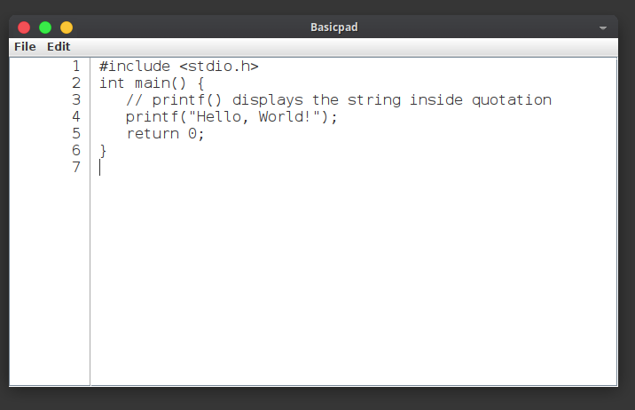

# BasicPad

### What is it?

Basic one file Notepad clone written in Java.

### What's so special about it?

It has line numbers and very basic edition options. Yes it can do 
undo/redo.

### Why this?

This is handy if you want to learn Java or you just need simple text editor
if you don't have it on Linux.  

### I don't know how to use this?

#### Compile:

javac BasicPad.java

#### Run: 

java BasicPad

#### Have fun

